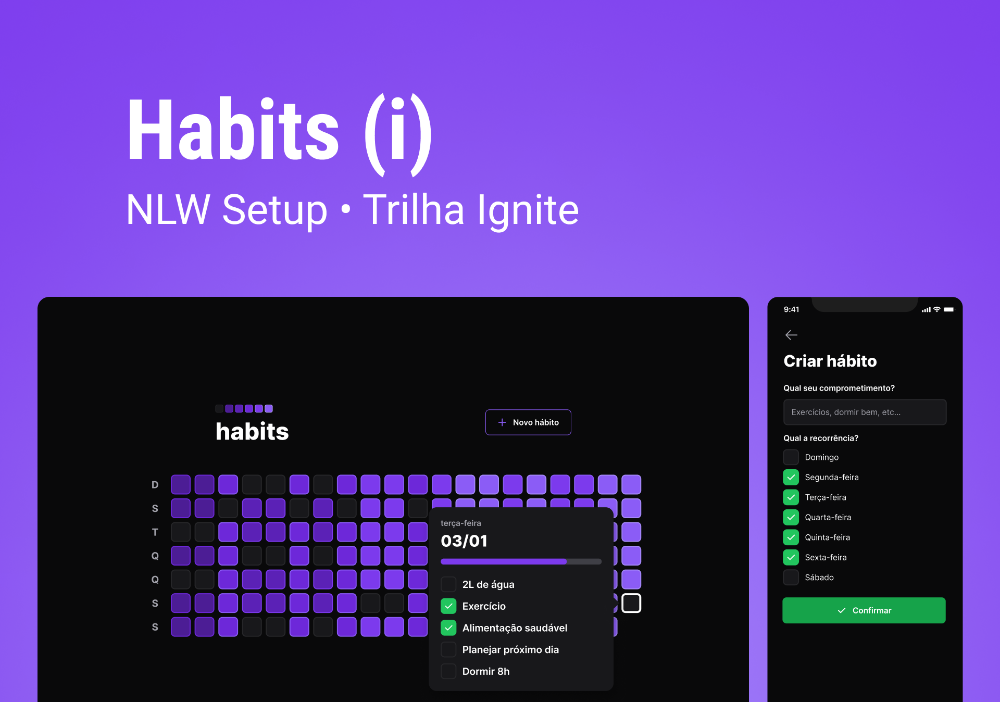

<h1 align="center">
    
</h1>

<br>

## 🧪 Tecnologias

Esse projeto foi desenvolvido usando as seguintes tecnologias:

- [Node](https://nodejs.org/en/)
- [React](https://reactjs.org)
- [React Native](https://reactnative.dev/)
- [TypeScript](https://www.typescriptlang.org/)
- [Fastify](https://www.fastify.io/)
- [Prisma](https://www.prisma.io/)
- [Tailwindcss](https://tailwindcss.com/)
- [NativeWind](https://www.nativewind.dev/)
- [Vite](https://vitejs.dev/)
- [Radix UI](https://www.radix-ui.com/)
- [Expo](https://expo.dev/)

## 🔖 Layout

Você pode visualizar o layout do projeto através do link abaixo:

- [Layout Web/Mobile](https://www.figma.com/community/file/1195326661124171197)

Lembrando que você precisa ter uma conta no [Figma](http://figma.com/).

## 💻 Projeto

O projeto é um Habit tracker.

O projeto foi desenvolvido durante a **[NLW Setup](https://app.rocketseat.com.br/event/nlw-setup)**, apresentada entre os dias 16 e 20 de Janeiro de 2023.

## Como rodar o projeto

### **Server**

Para rodar o projeto do server são necessários os seguintes passos após o clone do projeto.

- Entrar na pasta do server

```bash
nlw-setup> cd server
```

- Criar um arquivo .env a partir do arquivo exemplo

```bash
nlw-setup/server> cp .env.example .env
```

- Rodar as migrations e seed do banco de dados

```bash
nlw-setup/server> npx prisma migrate dev
```

- Iniciar o servidor

```bash
nlw-setup/server> npm run dev
```

### **App Web**

- Entrar na pasta do app web

```bash
nlw-setup> cd web
```

- Iniciar o app

```bash
nlw-setup/web> npm run dev
```

### **App Mobile**

A maneira mais fácil é instalar o Expo Go a partir da store do seu celular e rodar o programa diretamente no dispositivo.

- Entrar na pasta do app mobile

```bash
nlw-setup> cd mobile
```

- Iniciar o app mobile

```bash
nlw-setup/mobile> npm run start
```

A partir do app Expo Go, já instalado no seu celular, selecione a opção de ler código QR e aponte para o código gerado no terminal onde você iniciou o projeto mobile.
